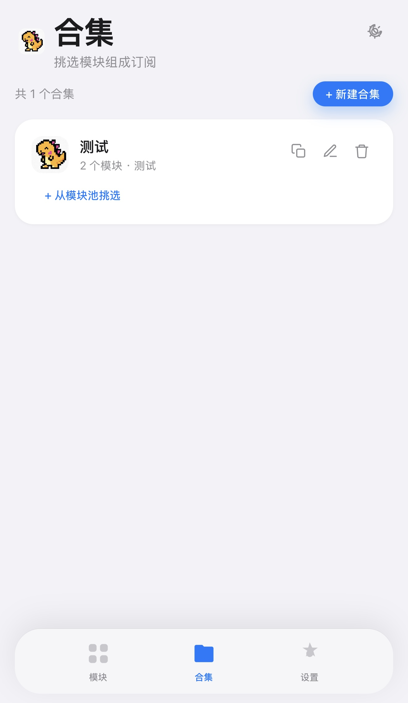
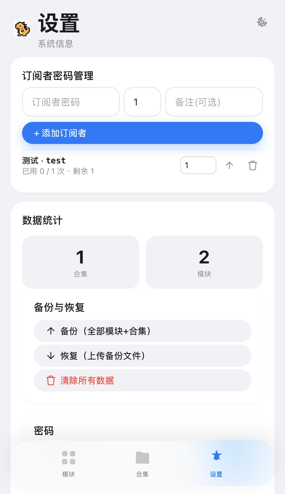

# Widgets For Rex

一个部署在 **Cloudflare Workers** 上的 Rex 播放器模块管理面板。用于存放、管理 Rex 的 JS 模块，并支持把模块组合成「合集」生成订阅链接，供 Rex 客户端拉取使用。

> 单人可维护、零服务器成本、基于 KV 持久化。UI 简洁适配移动端。

---
## 预览图
预览网页：https://test.fwd.ccwu.cc 密码：test


## 功能特性

### 模块管理（管理员面板）
- **上传模块**：本地上传 `.js` 模块文件（自动解析 `WidgetMetadata` 元数据）
- **链接导入**：通过远程 URL 导入模块
- **在线编辑**：直接在浏览器编辑模块源码
- **替换文件**：用新文件替换已有模块
- **远程刷新**：对来源为 URL 的模块一键拉取最新版
- **编辑信息**：修改标题 / 版本 / 作者 / 备注
- **删除模块**：删除时自动从所有合集中移除引用

### 合集订阅
- 把任意模块挑选组合成「合集」，生成 `.rex` 订阅链接
- 链接格式：`https://你的域名/api/collections/{合集名}.rex`

### 订阅用户模式（订阅用户面板）
- 管理员可**发放订阅者密码**，并管理每个订阅者的可生成次数
- 订阅者用密码登录后进入**只读模式**：
  - 不能上传 / 管理模块，只能浏览模块池
  - 只能挑选模块创建自己的合集（合集名**仅限数字或英文**）
  - 每人默认最多生成 **2 次**合集，剩余次数会在界面明确提醒
- 订阅者只能看到和管理自己创建的合集

### 其它
- **数据备份与恢复**：一键导出 / 导入全部模块 + 合集（JSON 备份）
- **明暗主题**：跟随系统 / 手动切换
- **管理员密码修改**：面板内直接修改
- **防止滥用**：同一 IP 5 次密码失败后将被ban ip，订阅用户生成模块合集的数量受管理员限制

---

## 部署教程（Cloudflare）

> 全程在 [dash.cloudflare.com](https://dash.cloudflare.com) 完成，无需本地环境。

### 0. 前置条件
- 一个 Cloudflare 账号（免费）

### 1. 创建 Worker
1. 登录 Cloudflare 控制台
2. 左侧菜单进入 **Workers & Pages**
3. 点击 **创建** → **创建 Worker**
4. 输入一个名称（如 `rex-panel`），选择 **Hello World** 模板，点击 **部署**

### 2. 粘贴代码
1. 进入刚创建的 Worker
2. 点击 **编辑代码** 进入编辑器
3. 全选并删除编辑器中的默认代码
4. 将本项目仓库中的 [index.js](index.js) 里的完整代码粘贴进去
5. 先点击 **保存并部署** 完成首轮部署

### 3. 创建并绑定 KV 命名空间
代码使用 KV 存储数据，必须绑定一个命名空间，**绑定变量名必须为 `REX_KV`**（大小写敏感）。

1. 左侧进入 **Storage & Databases** → **KV**
2. 点击 **创建命名空间**，命名如 `rex-kv`，创建
3. 回到 Worker → 点击 Worker 名称进入详情
4. 进入 **设置** → **变量** → **KV namespace 绑定**
5. 点击 **添加绑定**：
   - 变量名称：`REX_KV`
   - KV 命名空间：选择刚才创建的 `rex-kv`
6. 点击 **保存**

### 4. 设置管理员密码（环境变量）
1. 仍在 **设置** → **变量** 页面，找到 **环境变量**
2. 点击 **添加变量**：
   - 变量名称：`ADMIN_SECRET`
   - 值：你想要的**管理员密码**（至少 4 位）
3. 点击 **保存**

### 5. 完成部署
1. 回到 Worker **部署** 页面（或触发一次重新部署）
2. 访问 `https://{你的子域}.workers.dev` 即可打开面板
3. 用 `ADMIN_SECRET` 设置的密码登录

### 6.（可选）绑定自定义域名
1. Worker 详情 → **设置** → **域和路由**
2. 点击 **添加自定义域**，选择你已接入 Cloudflare 的域名并指定子域，将路由的  *.你的域名/*     改成  自定义前缀.你的域名/*   这种格式。例如：  rex.example.com/*  。  3. 去到Cloudflare 域名概览界面，选择你刚刚添加到worler的域名，点击DNS记录，添加一条CNAME记录，前缀填你刚刚自定义的前缀，关闭小黄云，目标填入：saas.sin.fan
4. 此后，你就可以通过你自定义的域名访问面板和相关文件链接了。

---

## 配置说明

| 配置项 | 类型 | 变量名 | 说明 |
|---|---|---|---|
| KV 绑定 | KV namespace | `REX_KV` | 必须与代码一致，存储所有数据 |
| 管理员密码 | 环境变量 | `ADMIN_SECRET` | 管理员登录密码（优先级：KV 中 `admin_password` 键 > 该变量） |
| KV 内管理员密码 | KV 键 | `admin_password` | 若未设 `ADMIN_SECRET`，可在此键写入 SHA-256 哈希 |

### KV 存储结构
| KV 键 | 内容 |
|---|---|
| `modules` | 全部模块元数据（JSON 数组） |
| `collections` | 全部合集（JSON 数组，含 `owner` 字段区分管理员 / 订阅者） |
| `subscribers` | 订阅者密码与配额（JSON 数组） |
| `file:{id}` | 每个模块的源码文件 |
| `admin_password` | 管理员密码 SHA-256 哈希（可选） |
| `rl:login:{ip}` | 登录失败计数（防爆破，10 分钟过期） |

---

## 使用方法

### 管理员
1. 用 `ADMIN_SECRET` 密码登录
2. **模块**页：上传 / 导入 / 编辑 / 删除模块
3. **合集**页：新建合集 → 从模块池挑选模块 → 复制 `.rex` 订阅链接
4. **设置**页：
   - 在「订阅者密码管理」添加订阅者密码、调整每个订阅者的生成次数、删除订阅者
   - 修改管理员密码、备份 / 恢复数据

### 订阅者
1. 在登录页输入管理员下发的**订阅者密码**进入订阅者模式
2. 只读浏览模块池，不能上传 / 管理模块
3. **合集**页新建合集（名称仅限数字或英文），从模块池挑选模块并保存
4. 剩余可生成次数会明确提醒，达到上限后无法再创建

---

## 订阅链接 / API

### 合集订阅链接
```
GET /api/collections/{slug}.rex
GET /api/collections/{slug}.fwd      # 兼容旧格式
```
返回（公开，无需登录）：
```json
{
  "title": "合集名",
  "description": "描述",
  "icon": "图标URL",
  "widgets": [
    {
      "id": "模块id",
      "title": "模块名",
      "description": "备注",
      "requiredVersion": "0.0.1",
      "version": "1.0.0",
      "author": "作者",
      "url": "https://你的域名/api/modules/{id}/raw"
    }
  ]
}
```

### 模块文件直链
```
GET /api/modules/{id}/raw
```
直接返回模块源码（`application/javascript`），供客户端下载。

### 管理 / 认证接口（均需对应登录态 Cookie）
| 方法 | 路径 | 说明 | 权限 |
|---|---|---|---|
| POST | `/api/admin/auth` | 管理员登录 | 公开 |
| POST | `/api/auth/subscriber` | 订阅者登录 | 公开 |
| GET | `/api/admin/modules` | 模块列表 | 管理员 / 订阅者 |
| POST/PATCH/PUT/DELETE | `/api/admin/modules` | 上传 / 编辑 / 替换 / 删除模块 | 仅管理员 |
| GET/POST/PATCH/DELETE | `/api/admin/collections` | 合集读写（订阅者仅限自己的） | 管理员 / 订阅者 |
| GET/POST/PATCH/DELETE | `/api/admin/subscribers` | 订阅者密码管理 | 仅管理员 |

---

## 模块格式说明

Rex 模块是普通的 JavaScript 脚本，可在文件头部声明元数据（可选），面板会自动解析：

```js
/* WidgetMetadata {
  "id": "com.example.weather",
  "title": "天气模块",
  "version": "1.0.0",
  "author": "你的名字"
} */
// ...模块代码
```

也支持 `WidgetMetadata = { ... }` 的写法。上传时会自动读取 `id / title / version / author` 作为模块信息；未声明的字段会用文件名兜底。加密模块（文件内检测到特殊字节）会被识别并锁定为只读。

---

## 技术栈

- **运行时**：Cloudflare Workers（JavaScript）
- **存储**：Cloudflare KV（`REX_KV`）
- **前端**：原生 HTML + JS（内嵌于 Worker，iOS 风格，无外部依赖）

---

## License

本项目仅供学习交流使用。
